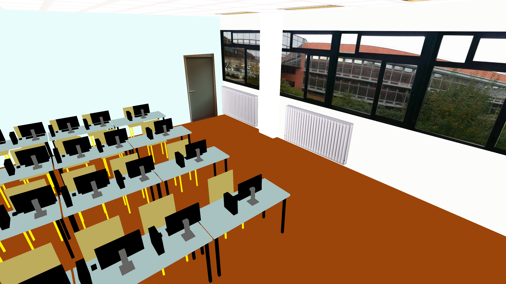

# Projet d'infographie

## Auteur(s)

|Nom|Prénom|Année|Module|email|
|--|--|--|--|--|
| *Ait Hammi* | *Massinissa* | *M1 iWOCS* | *Infographie* |*massinissaait2018@gmail.com*
## Plan

* [Le Projet](#le-Projet)
* [Objectif ](#objectif)
* [Code](#code)
* [Aperçue de la salle vue de l’intérieur](#aperçue)
* [Touche](#touche)

## Le Projet

- Créer à l'aide de processing une scène qui représentera la salle de TP A106

## Objectif
- Savoir utiliser l'intégralité des éléments  évoqués en cours
- Placer une camera dans la scène et permettre le déplacement dans celle-ci
- Placer plusieurs lumières dans la scène 
- Modéliser les objets de la salle mais(une déformations de cubes sont tout à fait suffisantes)
- Appliquées à certains objets des textures
- Avoir une scène qui ressemble beaucoup à la salle A106 réel.

 ## Code 
 - Le dossier image contient les différentes textures qu'on a utilisé
 - Le dossier Shader contient les shaders procéduraux
 - BTM.pde se charge de contruire les mure de la salle ainsi que le plafond et le sole
 - Pc_Table_Chaise.pde , comme son nom l'indique elle nous permet de crée les pc les tables et les chaise 
- Cote_Mure.pde nous permet de crée les formes à l'intérieur de la salle comme le tableau la fenetre vers l'extérieur les chauffages ..
- A106.pde c'est le fichier principale qui fait appelle à tout les autres 

 ##  Aperçue de la salle vue de l’intérieur .
 

 ## Touche:
 **Caméra**

- La caméra est dirigée à l'aide de la souris 
 
- ↑   ou 'z' :  Avancer (Maintenir la touche)
- ↓ ou 's' :  Reculer (Maintenir la touche)
-  →    ou 'd' :  Allez à droite (Maintenir la touche)
-  ←   ou 'q' :  Allez à gauche(Maintenir la touche)
- Bouton souris gauche :  Maintenir la touche tout en tournant légèrement la souris vers une direction sert à orienter la vue vers cette dernière.

**Lumière**
  
- La touche ESPACE : Allumer ou éteindre la Lumière
- La touche ALT : Passer en mode Alarme incendie(Appuyer sur n'importe quelle touche pour quitter)
	

**Intérieur**
- Le clic de souris droit ou gauche sans le clavier tactile : Sert à dérouler ou enrouler le rideau projecteur.

